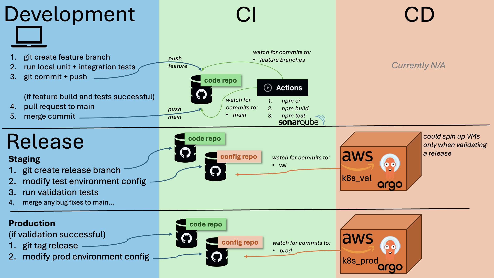
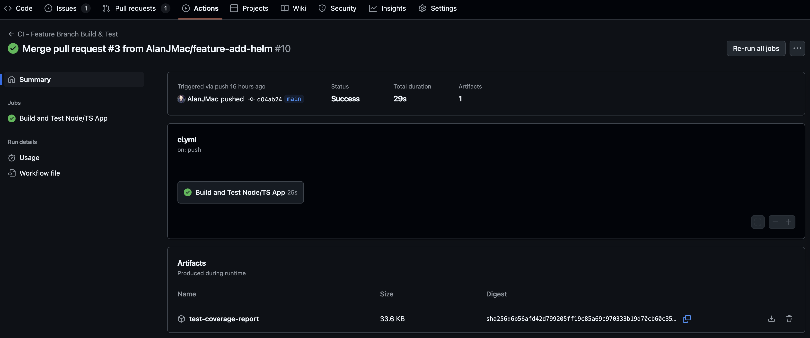
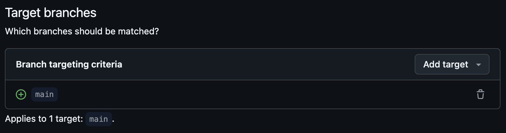
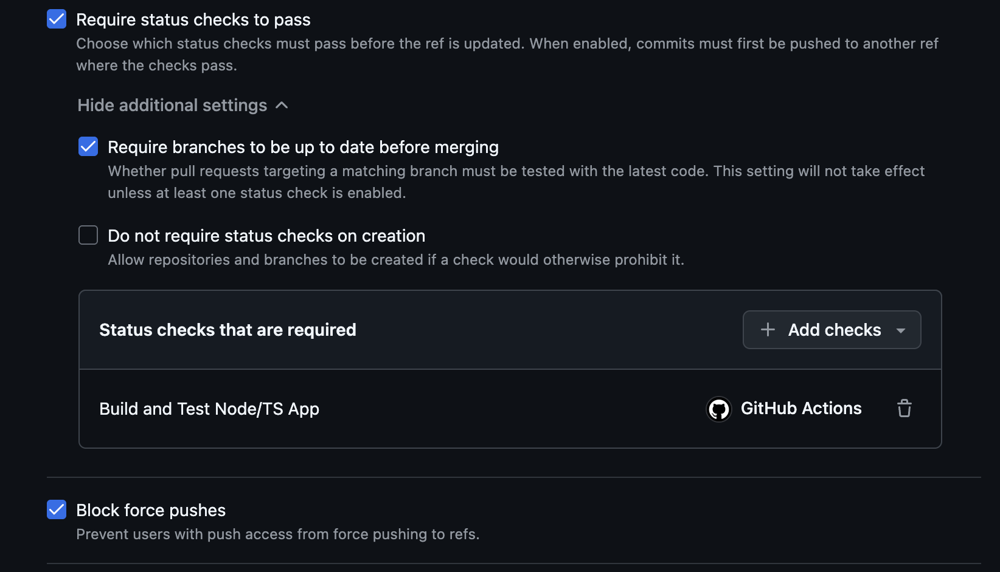
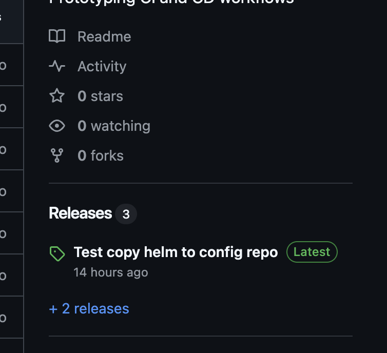
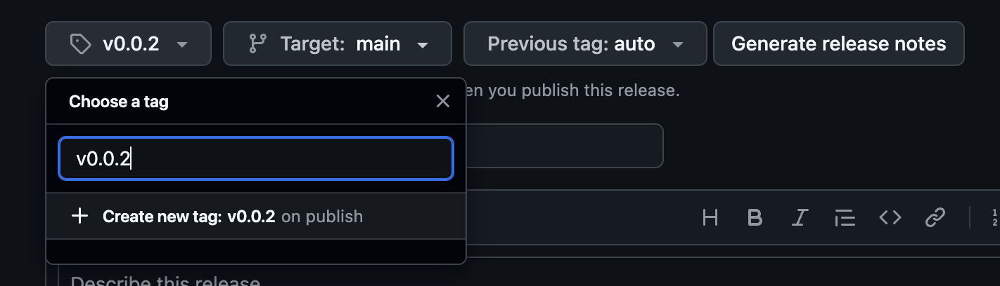
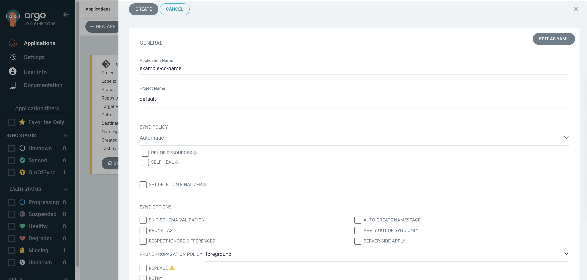
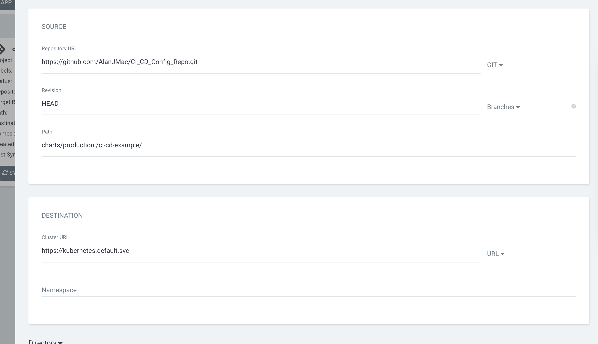

# CI_CD_Example

This repository provides an example of Continuous Integration (CI) and Continuous Deployment (CD) for a project.

The main CI tool used is: [GitHub Actions](https://github.com/features/actions) <br>
The main CD tool used is: [ArgoCD](https://argo-cd.readthedocs.io/en/stable/getting_started/)

## Workflow



## CI - GitHub Actions

GitHub Actions will trigger automatically based on the YAML files defined in the [.github/workflows directory](./.github/workflows/) of the application repository.

The GitHub Actions pages have detailed documentation on how to write the workflow files and there are many [starter templates](https://docs.github.com/en/actions/how-tos/writing-workflows/using-workflow-templates) or existing Actions in the [marketplace](https://github.com/marketplace).

The Actions are executed in "Runners". These Runners can either be hosted on GitHub or self-hosted. <br>
Note that on the free plan, we are limited to 2000 minutes of GitHub-hosted runners, which is more than enough in most cases. After this then each runner minute will be billed - this is still potentially cheaper than self-hosting on, e.g. AWS.

### Example Workflow

An example workflow file starts with a name and the details of when the workflow will be triggered:

```
name: CI - Feature Branch Build & Test

on:
  push:
    branches:
      - main
  pull_request:
    branches:
      - main
```

This workflow will be triggered whenever someone pushes or makes a pull request to the `main` branch.

Next, the workflow defines one or more jobs, which are made up of one or more steps. E.g.

```
jobs:
  build-and-test:
    runs-on: ubuntu-latest
    name: Build and Test Node/TS App
```

The name of the job specified here is "Build and Test Node/TS App". This name can be used by other actions in GitHub, for example for checking the run status of a job (see Branch Protection later).

We can then specify a number of steps to run:

```
steps:
  - name: Checkout code
    uses: actions/checkout@v4
```

`uses:` means to use an existing actions, in this case to checkout the code from this repository to be used in subsequent steps

```
  - name: Setup Node.js
    uses: actions/setup-node@v4
    with:
      node-version: '22' # Use your project's version
```

This step installs a particular version of node in the runner.

```
  - name: Install dependencies
    run: npm ci

  - name: Build the app
    run: npm run build

  - name: Run unit tests with coverage
    run: npx vitest run --coverage
```

These steps install, build and test the code in the checked out repository. The test command will create a coverage report that will be generated inside the runner but not stored anywhere unless we explicitly upload it somewhere:

```
  - name: Upload coverage report
    uses: actions/upload-artifact@v4
    with:
      name: test-coverage-report
      path: coverage
```

This final step uses the upload-artifact action to upload the generated test coverage report in the output of the workflow. This can be viewed by selecting a completed workflow and scrolling down to the attached artifacts.
.

Uploaded artifacts can, of course, also be the packaged software generated during the build steps or any other files generated during the workflow.

### Branch Protection

A useful step in CI is to prevent pushing broken code to the main branch. GitHub allows `Rulesets` to be defined on branches that can restrict what interactions can be made with a repository.

A new `Ruleset` can be defined by going to Settings of a repository and under "Code and automation" clicking on either:

- Branches -> Add branch ruleset
  or
- Rules -> Rulesets -> New ruleset

After specifying a `Ruleset Name`, specify which branches the rules should apply to. E.g. "main"


Then specify which rules to apply. In this case, we want to restrict pushing or making pull requests to the main branch if the code fails to build or any tests fail. We previously specified a GitHub Action to run on any push or pull request to `main` that would build and test the code. If any of these steps fail then the workflow will return a failure code. We can check this status by selecting the rule "Require status checks to pass". <br>
Then, in the additional settings, we can select "Require branches to be up to date before merging" and also link the "Status checks that are required" to the output of one the defined jobs.


### Releases (and Pre-Releases)

Releases can be created from within GitHub by selecting the "Releases" link on the right-side of a repository (this could also be automated by the GitHub CLI if desired) and clicking the button "Draft a new release".


When creating a new Release, a new tag of the code will be made. The tag should follow typically semantic versioning. Type in a new tag name and specify that it will be created on publish.


For a pre-release, e.g. for validation testing before deploying to production, a pre-release version name can be specified, e.g. v0.0.1-beta, and select the checkbox at the bottom of the form: "Set as a pre-release". <br>
Clicking "Publish release" will then generate the tag, the release (or pre-release) and trigger any related GitHub actions.

An example of Actions to run on publishing a release can be found in this repository:

- [pre-release.yml](./.github/workflows/pre-release.yml)
- [release.yml](./.github/workflows/release.yml)

To distinguish between running a workflow on release or pre-release, we can specify this in the `on` description:

```
on:
  release:
    types: [prereleased]
```

or

```
on:
  release:
    types: [released]
```

respectively.

These release Actions could be defined to generate the software artifacts to be distributed, or in the case of this repository, update an associated configuration repository with the latest release configuration. This is where the CD tool steps in.

## CD - ArgoCD

A very useful and easy to follow introduction to ArgoCD is given in this video: https://www.youtube.com/watch?v=MeU5_k9ssrs

In essence, ArgoCD is installed inside a running k8s cluster and is configured to watch for changes in a folder in a given git repository. If there are changes, then this will trigger a deployment of the new pods to the cluster.

Installing ArgoCD in a cluster is as simple as:

1. `kubectl create namespace argocd`
2. `kubectl apply -n argocd -f https://raw.githubusercontent.com/argoproj/argo-cd/stable/manifests/install.yaml`
3. verify, `kubectl get pod -n argocd` and `kubectl get svc -n argocd`
4. port forwarding, if needed, `kubectl port-forward -n argocd svc argocd-server 8091:443`

ArgoCD will then be accessible in a browser, e.g. https://localhost:8091.

An Application can be added for ArgoCD to watch by clicking the "New App" button:

Leave the Project Name as "default" in order to just use the main branch.

To watch for a specific repository folder, enter the details in the "SOURCE" section, referencing the git repository URL and the path to watch:


For example, if we have a staging environment for validation testing, we can tell ArgoCD to watch the staging directory for changes and these will be applied to the cluster. Similarly, for a production environment.

In the "Destination" section, we specify "https://kubernetes.default.svc" because ArgoCD is running inside the same k8s cluster that we want to deploy to. The namespace can be the name of the project.
